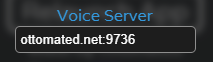

[![GPL-3.0 License][license-shield]][license-url]

<br />
<p align="center">
  <a href="https://github.com/ottomated/crewlink-server">
    
  </a>

  <h3 align="center">CrewLink Server</h3>

  <p align="center">
    Voice Relay server for <a href="https://github.com/ottomated/crewlink">CrewLink</a>.
    <br />
    <a href="https://github.com/ottomated/crewlink-server/issues">Report Bug</a>
    ·
    <a href="https://github.com/ottomated/crewlink-server/issues">Request Feature</a>
  </p>
</p>


<!-- TABLE OF CONTENTS -->
## Table of Contents

* [About the Project](#about-the-project)
* [Getting Started](#getting-started)
  * [Prerequisites](#prerequisites)
  * [Installation](#installation)
* [Contributing](#contributing)
* [License](#license)


<!-- ABOUT THE PROJECT -->
## About The Project

This is the relay server for CrewLink, an Among Us proximity voice chat program. I am currently hosting a server at `ottomated.net:9736`, but if you want a more reliable option I would suggest to deploy this repository yourself.


## Getting Started

### Prerequisites

This is an example of how to list things you need to use the software and how to install them.
* [node.js](https://nodejs.org/en/download/)
* yarn
```sh
npm install yarn -g
```

### Installation

1. Clone the repo
```sh
git clone https://github.com/ottomated/crewlink-server.git
cd crewlink-server
```
2. Install NPM packages
```sh
yarn install
```
3. Compile and run the project
```JS
yarn start
```
4. Copy your server's IP and port into CrewLink settings. Make sure everyone in your lobby is using the same server.



<!-- CONTRIBUTING -->
## Contributing

Any contributions you make are greatly appreciated.

1. Fork the Project
2. Create your Feature Branch (`git checkout -b feature/AmazingFeature`)
3. Commit your Changes (`git commit -m 'Add some AmazingFeature'`)
4. Push to the Branch (`git push origin feature/AmazingFeature`)
5. Open a Pull Request


## License

Distributed under the GNU General Public License v3.0. See `LICENSE` for more information.


[license-shield]: https://img.shields.io/github/license/ottomated/crewlink.svg?style=flat-square
[license-url]: https://github.com/ottomated/crewlink-server/blob/master/LICENSE